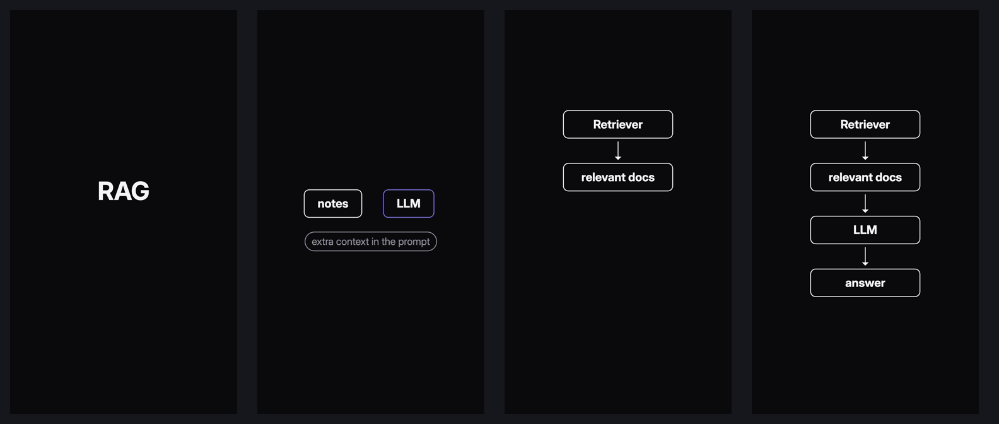
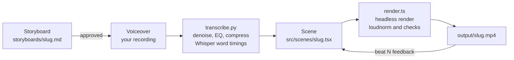

<div align="center">

# oncue

**Record your voiceover. The animation lands on your words.**

Local-first pipeline for 30–60 second vertical explainer reels, animated in code and timed to the words in your real recording.

[](https://docs.re.video)
[](video/tsconfig.json)
[](https://nodejs.org)
[](pyproject.toml)
[](https://github.com/SYSTRAN/faster-whisper)
[](#how-it-works)



<sub>Frames from a rendered reel. Each element appears on the word that introduces it.</sub>

</div>

---

## Why oncue

Explainer animation usually works the wrong way round: you animate to a script, then re-record or re-edit until the voice fits. oncue starts from the voice. You record a natural take, local Whisper extracts a timestamp for every word, and each scene waits for the words it illustrates. Re-record with different pacing and the same scene re-syncs on the next render.

There is no timeline to drag and no editor to click through. A reel is a storyboard, a recording and a short TypeScript scene.

## Features

- **Word-level sync.** `startOf('dobara train')` gives the exact second a phrase is spoken. Scenes never hardcode durations.
- **Hinglish-aware transcription.** The storyboard's script steers Whisper, so Roman Hindi stays as spoken instead of being translated to English.
- **Voice cleanup built in.** DeepFilterNet denoising, an 80 Hz highpass and gentle compression, all on CPU with no Python ML stack.
- **Consistent loudness.** Two-pass EBU R128 normalization to -16 LUFS / -1.5 dBTP, the usual target for social video.
- **Checks on every render.** Audio stream, loudness, duration within 30–60s, and a per-beat report of how far each visual lags its word, measured from the rendered frames.
- **A small component library.** `ConceptBox`, `Arrow`, `FlowStep`, `Tag`, `Headline` and `Highlight`, with motions such as `fadeIn`, `slideIn`, `draw` and `clearScene`. Scenes read like the storyboard.
- **One theme file.** Every colour, type size, spacing value and duration lives in `theme.ts`, with platform safe areas built in.
- **Local and reproducible.** Pinned npm and uv lockfiles, a bundled font, a checksum-verified denoiser binary and telemetry disabled. No accounts, API keys or per-video costs.

## How it works



| Stage | What happens | Output |
|---|---|---|
| **Storyboard** | Hook plus 4–6 beats. Each beat has the exact sentence to say and what appears on screen. | `storyboards/<slug>.md` |
| **Transcribe** | Raw take → DeepFilterNet → highpass → compressor → stereo mp3 → faster-whisper, prompted with the storyboard. | `public/audio/<slug>.mp3`, `timings/<slug>.json` |
| **Scene** | Each beat waits for its first spoken words, then animates with components and motions. | `src/scenes/<slug>.tsx` |
| **Render** | Headless Revideo render with audio, two-pass loudnorm, then duration and per-beat sync checks. | `output/<slug>.mp4` |
| **Review** | Feedback per beat (`beat 3: …`), re-render, repeat. | |

## Quick start

### Prerequisites

| Tool | Version | Install (macOS) |
|---|---|---|
| Node.js | ≥ 18 (developed on 26) | `brew install node` |
| FFmpeg | any recent build | `brew install ffmpeg` |
| uv | any recent | `brew install uv` |

The denoiser binary supports macOS (arm64, x86_64) and Linux (x86_64, aarch64).

### Install

```bash
git clone https://github.com/Divit-aggarwal/oncue.git
cd oncue
uv sync                              # .venv with faster-whisper

cd video
npm ci                               # exact versions from package-lock.json
scripts/setup-deep-filter.sh         # downloads deep-filter, verifies sha256
cp .env.example .env                 # optional local settings
```

The first transcription downloads the Whisper `small` model (about 480 MB). After that, everything runs offline.

## Making a reel

All commands run from `video/`.

**1. Scaffold**

```bash
scripts/new-reel.sh what-is-a-token
```

This creates `storyboards/what-is-a-token.md` and `src/scenes/what-is-a-token.tsx` from templates.

**2. Storyboard.** Fill in the hook and beats. Each beat's `**Say:**` line is the exact sentence you'll record, since Whisper uses it as a spelling guide.

**3. Record and transcribe**

```bash
uv run python scripts/transcribe.py what-is-a-token ~/Recordings/take1.m4a
```

Any format FFmpeg can read works as input. Your raw file is never modified.

**4. Write the scene.** Here is the start of the example reel, [`src/scenes/smoke_take1.tsx`](video/src/scenes/smoke_take1.tsx):

```tsx
export default function* (view: View2D) {
  const {timings, startOf} = loadTimings('smoke_take1');
  const y = safeArea.centerY;
  yield view.add(<Audio src={'/audio/smoke_take1.mp3'} play />);
  // Beat 1: Basically RAG mein model ko dobara train nahi kar rahe.
  yield* waitUntil(startOf('Basically RAG mein'));
  yield* fadeIn(<Headline text="RAG" y={y - 60} />);
  yield* waitUntil(startOf('dobara train'));
  yield* fadeIn(<Tag text="no retraining" y={y + 90} />);
  // Beat 2: Hum bas model ko notes de rahe hain.
  yield* clearScene(startOf('Hum bas model'));
  yield* fadeIn(<ConceptBox label="LLM" variant="accent" x={180} y={y} />);
  yield* waitUntil(startOf('notes'));
  yield* slideIn(<ConceptBox label="notes" x={-180} y={y} />, 'left');
  // …
  yield* waitUntil(timings.duration);
}
```

`clearScene` fades out the previous beat just before the next beat's first word, so the new visual enters on the word itself.

**5. Render**

```bash
npm run render -- what-is-a-token
```

Output from the example reel:

```text
output:   output/smoke_take1.mp4
streams:  video, audio
duration: 12.03s
loudness: -24.3 LUFS -> -15.9 LUFS (two-pass loudnorm, linear)
size:     0.65 MB
FLAG: duration 12.03s is outside 30–60s
beat 1:   word 0.00s, visual 0.07s, lag +0.067s
beat 2:   word 4.80s, visual 4.87s, lag +0.067s
beat 3:   word 7.64s, visual 7.67s, lag +0.027s
```

Any beat more than 0.3s late, or a duration outside 30–60s, is printed as a `FLAG:` line. The example is a 12-second pipeline test, so its duration is flagged. Its voiceover isn't committed, so a fresh clone can't re-render it.

**Preview (optional).** Scrub the reel in the Revideo editor:

```bash
VITE_SLUG=what-is-a-token npm run preview    # http://localhost:9000
```

## Components

| Component | Purpose |
|---|---|
| `ConceptBox` | Labelled box for one concept, with an optional sublabel and accent variants |
| `Arrow` | Connects two nodes edge to edge and follows them if they move |
| `FlowStep` | Vertical chain of boxes and arrows, revealed a few steps at a time |
| `Tag` | Small pill caption |
| `Headline` | Large title text |
| `Highlight` | Outline drawn around an existing node |

| Motion | Effect |
|---|---|
| `fadeIn` / `fadeOut` | Fade nodes in, or out and remove them |
| `slideIn(node, from)` | Enter from just off-screen |
| `draw` | Draw an `Arrow` or `Highlight` |
| `highlight` | Pulse a node |
| `clearScene(wordTime)` | Empty the screen exactly on the next beat's first word |

Props and examples: [`docs/COMPONENTS.md`](docs/COMPONENTS.md).

## Configuration

| Setting | Where | Default | Purpose |
|---|---|---|---|
| `DEEP_FILTER_ATTEN_LIM` | `video/.env` or environment | `100` | Denoise strength in dB. Lower it to 30–60 if a take sounds muffled. |
| `VITE_SLUG` | environment | none | Which reel `npm run preview` opens |
| Visual theme | `video/src/lib/theme.ts` | | Colours, Inter type scale (headline 120 / body 56 / caption 48), spacing, durations, safe margins (top 120px, bottom 200px) |
| Output format | `video/src/project.tsx` | 1080×1920, 30 fps | Canvas size, frame rate, background |

## Project structure

```text
oncue/
├── storyboards/              one storyboard per reel (the approval document)
├── docs/
│   ├── COMPONENTS.md         component and motion reference
│   └── …                     product vision, voice and timing, roadmap
├── pyproject.toml            Python deps (faster-whisper)
└── video/                    Revideo project
    ├── render.ts             render → audio check → loudnorm → sync report
    ├── scripts/
    │   ├── new-reel.sh       scaffold a reel
    │   ├── transcribe.py     voice cleanup + word timings
    │   └── setup-deep-filter.sh
    ├── src/
    │   ├── project.tsx       canvas settings, font loading, scene selection
    │   ├── lib/              theme.ts, timing.ts
    │   ├── components/
    │   ├── motions/
    │   └── scenes/           one scene per reel
    ├── timings/              Whisper word timings (committed)
    ├── public/               fonts (committed), audio (ignored)
    └── output/               rendered MP4s (ignored)
```

## Troubleshooting

<details>
<summary><code>"&lt;words&gt;" not found in &lt;slug&gt;</code></summary>

Whisper heard something different from the phrase passed to `startOf`. The error lists the next words it did hear. Use those, or fix the storyboard's `**Say:**` line and re-run `transcribe.py`.
</details>

<details>
<summary>The transcript is in English, not Hinglish</summary>

The storyboard didn't exist when you transcribed. Whisper needs its `**Say:**` lines as a prompt. Create the storyboard, then re-run `transcribe.py`.
</details>

<details>
<summary>The voice sounds muffled after cleanup</summary>

Set `DEEP_FILTER_ATTEN_LIM=40` (anywhere from 30 to 60) in `video/.env` and re-run `transcribe.py`. Your raw recording is untouched.
</details>

<details>
<summary>Text renders in a serif font</summary>

Inter failed to load. Check that `video/public/fonts/InterVariable.woff2` exists. The headless browser has no system copy.
</details>

<details>
<summary>Preview shows <code>no src/scenes/.tsx</code></summary>

No reel is selected. Start the editor with `VITE_SLUG=<slug> npm run preview`.
</details>

More in [`CLAUDE.md` → Known issues](CLAUDE.md#known-issues).

## Working with an AI assistant

oncue is built to be driven by a coding assistant under the creator's direction. [`CLAUDE.md`](CLAUDE.md) holds the rules: the approval gate, the pipeline checklist, the regression test, and the known issues in Revideo, Whisper and deep-filter. The creator owns the idea, voice and visual identity; the assistant handles implementation.

## Documentation

| Doc | Contents |
|---|---|
| [`CLAUDE.md`](CLAUDE.md) | Pipeline reference, new-reel checklist, regression test, known issues |
| [`docs/COMPONENTS.md`](docs/COMPONENTS.md) | Component and motion API |
| [`docs/01_PRODUCT_VISION.md`](docs/01_PRODUCT_VISION.md) | Purpose, principles, non-goals |
| [`docs/05_VOICE_AND_TIMING.md`](docs/05_VOICE_AND_TIMING.md) | Voice as the timeline |
| [`docs/10_FUTURE_AUTOMATION.md`](docs/10_FUTURE_AUTOMATION.md) | Roadmap for automation |

## Built with

- [Revideo](https://github.com/midrender/revideo): code-driven video with headless rendering
- [faster-whisper](https://github.com/SYSTRAN/faster-whisper): local Whisper with word timestamps
- [DeepFilterNet](https://github.com/Rikorose/DeepFilterNet): speech enhancement
- [FFmpeg](https://ffmpeg.org): audio processing and loudness normalization
- [Inter](https://rsms.me/inter/): typeface, SIL Open Font License ([license](video/public/fonts/Inter-LICENSE.txt))
